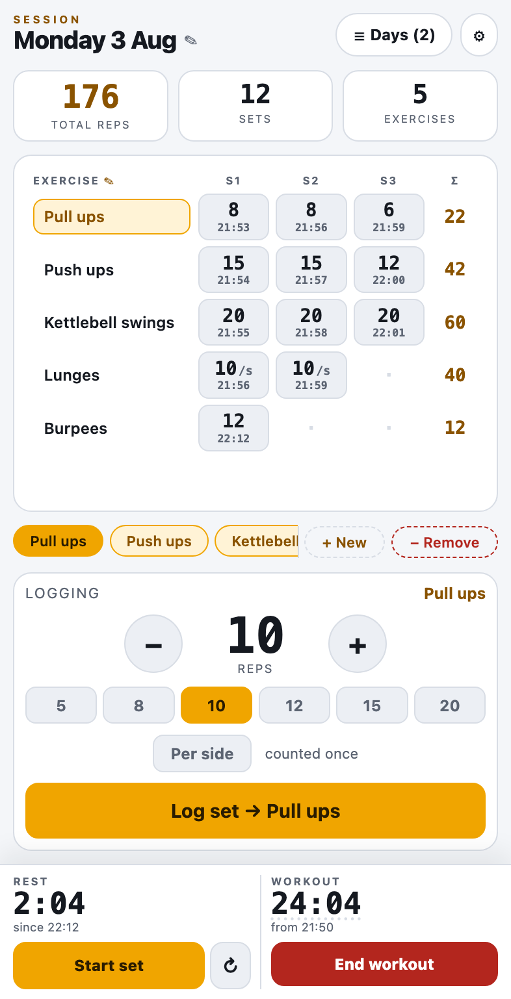
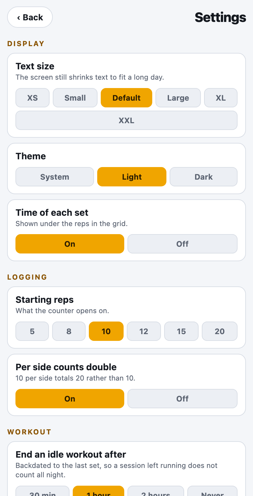
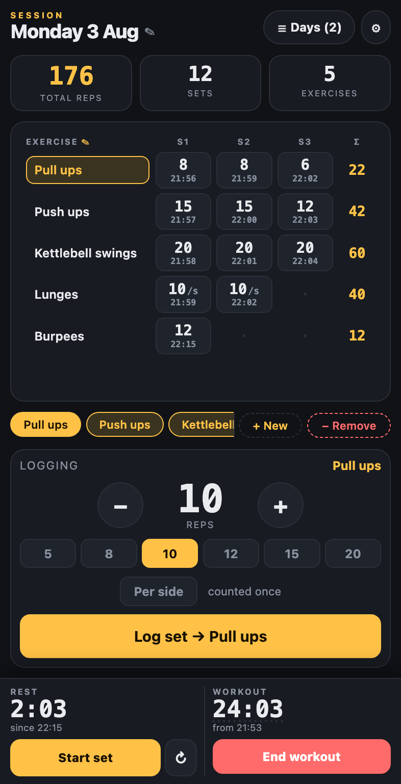

# Workout tracker

An offline rep logger. Everything lives in the browser's localStorage; CSV
export/import moves history between devices.

**[nicholasantoniadesengineer.github.io/workout_tracker](https://nicholasantoniadesengineer.github.io/workout_tracker/)**
— add it to the iOS home screen from Safari for a full-screen app.

  
  
  

## Using it

A day starts empty — pick from the strip under the table, which also holds
*+ New* and *− Remove* for the selected exercise.

Two clocks sit at the bottom. **Workout** runs between *Start workout* and *End
workout*; tap the clock to type in a time you have already been going. **Rest**
counts from the last set. *Start set* stamps the beginning of a set, so logging
it records the work time separately from the rest before it.

## Settings

Text size, theme, whether per-side sets count double, starting reps, and when an
idle workout ends itself.

## Notes

The logging screen never scrolls vertically — text shrinks to fit the window.
Sets grow rightward, so the table scrolls sideways past three columns.

CSV columns: `Date, Day, Started, Ended, Exercise, Set, Reps, Side, Rest, Work, At`.
`Date` is the merge key, so re-importing a day replaces it; a spreadsheet that
reformats that column will duplicate the day instead.

ES modules — serve over http(s), not `file://`.
